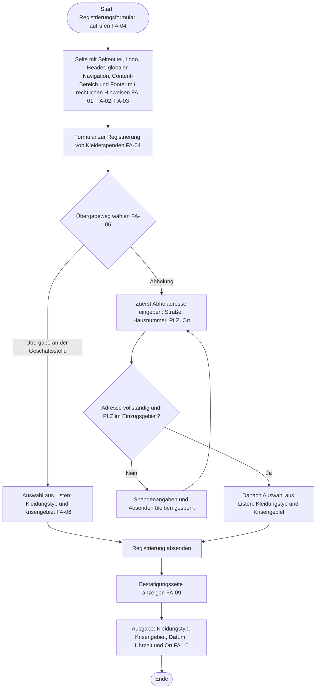

<!-- [MermaidChart: 941f2af2-c6fd-4d3b-9378-c8d99cff46c0] -->

```mermaid
graph TD
    Start([Start: Registrierungsformular aufrufen FA-04])

    Start --> UI[Seite mit Seitentitel, Logo, Header, globaler Navigation, Content-Bereich und Footer mit rechtlichen Hinweisen FA-01, FA-02, FA-03]
    UI --> Form[Formular zur Registrierung von Kleiderspenden FA-04]

    Form --> Choice{Übergabeweg wählen FA-05}

    Choice -- "Übergabe an der Geschäftsstelle" --> InputGS[Auswahl aus Listen: Kleidungstyp und Krisengebiet FA-06]
    InputGS --> Submit[Registrierung absenden]

    Choice -- "Abholung" --> InputAbh[Zuerst Abholadresse eingeben: Straße, Hausnummer, PLZ, Ort]
    InputAbh --> Gate{Adresse vollständig und PLZ im Einzugsgebiet?}
    Gate -- "Nein" --> Wait[Spendenangaben und Absenden bleiben gesperrt]
    Wait --> InputAbh
    Gate -- "Ja" --> InputDetails[Danach Auswahl aus Listen: Kleidungstyp und Krisengebiet]
    InputDetails --> Submit

    Submit --> Confirm[Bestätigungsseite anzeigen FA-09]
    Confirm --> Output[Ausgabe: Kleidungstyp, Krisengebiet, Datum, Uhrzeit und Ort FA-10]
    Output --> End([Ende])
```
