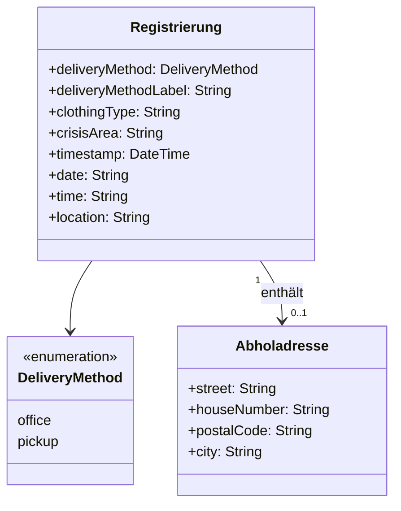

```mermaid
classDiagram
    class Registrierung {
        +deliveryMethod: DeliveryMethod
        +deliveryMethodLabel: String
        +clothingType: String
        +crisisArea: String
        +timestamp: DateTime
        +date: String
        +time: String
        +location: String
    }

    class Abholadresse {
        +street: String
        +houseNumber: String
        +postalCode: String
        +city: String
    }

    class DeliveryMethod {
        <<enumeration>>
        office
        pickup
    }

    Registrierung --> DeliveryMethod
    Registrierung "1" --> "0..1" Abholadresse : enthält
```
