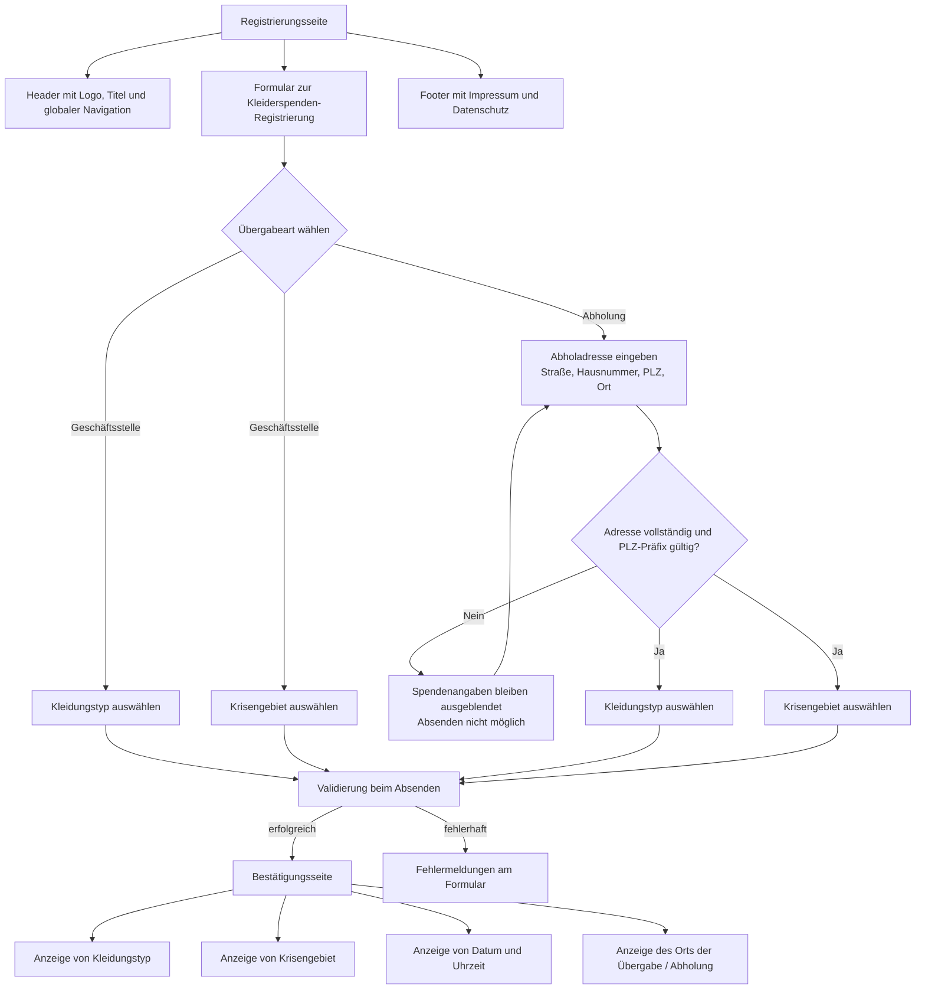

```mermaid
flowchart TD
    A[Registrierungsseite] --> B[Header mit Logo, Titel und globaler Navigation]
    A --> C[Formular zur Kleiderspenden-Registrierung]
    A --> D[Footer mit Impressum und Datenschutz]

    C --> E{Übergabeart wählen}
    E -->|Geschäftsstelle| F[Kleidungstyp auswählen]
    E -->|Geschäftsstelle| G[Krisengebiet auswählen]

    E -->|Abholung| J[Abholadresse eingeben<br/>Straße, Hausnummer, PLZ, Ort]
    J --> K{Adresse vollständig und PLZ-Präfix gültig?}
    K -->|Nein| M[Spendenangaben bleiben ausgeblendet<br/>Absenden nicht möglich]
    M --> J
    K -->|Ja| H[Kleidungstyp auswählen]
    K -->|Ja| I[Krisengebiet auswählen]

    F --> N[Validierung beim Absenden]
    G --> N
    H --> N
    I --> N

    N -->|erfolgreich| O[Bestätigungsseite]
    N -->|fehlerhaft| P[Fehlermeldungen am Formular]

    O --> Q[Anzeige von Kleidungstyp]
    O --> R[Anzeige von Krisengebiet]
    O --> S[Anzeige von Datum und Uhrzeit]
    O --> T[Anzeige des Orts der Übergabe / Abholung]
```
